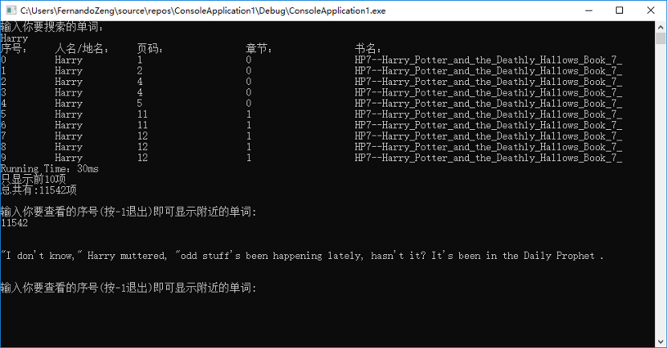

【问题描述】

将哈利波特的7本书（txt格式）读入，然后在指定了人名/地名后，显示查询结果，选择指定查询结果序号（选择查询内容），能够显示指定查询结果所在位置前后的一段文字。

【输入形式】

哈利波特的7本书，txt文件

【输出形式】

人名/地名输出：

1. 显示查找到的人名/地名，以及出现的页码和章节，书名， 按照出现的页码顺序显示，每个查询结果都对应序号。

   序号    人名/地名     页码    章节    书名

   1        Harry       1       1     Harry_Potter_and_the_Chamber_of_Secrets_Book_2

2. 选择查询结果记录项时，显示指定的人名/地名位置前后的一段文字。

   选择序号，或者单击查询记录行，能够显示到指定位置人名/地名前后的一段文字。如选择序号1，应显示：

   Not for the first time, an argument had broken out over breakfast at number four, Privet Drive. Mr. Vernon Durs-

   ley had been woken in the early hours of the morning by a loud, hooting noise from his nephew Harry’s room.

【其他要求】

其他要求：

1. 界面无要求，可以选择图形界面，也可以只是罗列查询结果即可。支持输入人名/地名，显示查询结果。选择序号，或者单击查询记录行，能够显示到指定位置人名/地名前后的一段文字。如选择序号1，应显示：

2. 提交方式，需要提供一个word文档，对程序设计和实现结果进行说明。模板参看附件。还需要提供源程序代码。

   [实验报告格式（样例）.docx](https://n.ustb.edu.cn/http/77726476706e69737468656265737421a2a713d275603c1e285ac7fdce00/userfiles/file/1537836472518014787.docx)

[J.K. Rowling - HP 0 - Harry Potter Prequel.txt](https://n.ustb.edu.cn/http/77726476706e69737468656265737421a2a713d275603c1e285ac7fdce00/userfiles/file/1537835839070042080.txt)

[HP7--Harry_Potter_and_the_Deathly_Hallows_Book_7_.txt](https://n.ustb.edu.cn/http/77726476706e69737468656265737421a2a713d275603c1e285ac7fdce00/userfiles/file/1537835838814021493.txt)

[J.K. Rowling - HP 3 - Harry Potter and the Prisoner of Azkaban.txt](https://n.ustb.edu.cn/http/77726476706e69737468656265737421a2a713d275603c1e285ac7fdce00/userfiles/file/1537835840376093816.txt)

[HP2--Harry_Potter_and_the_Chamber_of_Secrets_Book_2_.txt](https://n.ustb.edu.cn/http/77726476706e69737468656265737421a2a713d275603c1e285ac7fdce00/userfiles/file/1537835838730035402.txt)

[J.K. Rowling - Quidditch Through the Ages.txt](https://n.ustb.edu.cn/http/77726476706e69737468656265737421a2a713d275603c1e285ac7fdce00/userfiles/file/1537835855727087219.txt)

[J.K. Rowling - The Tales of Beedle the Bard.txt](https://n.ustb.edu.cn/http/77726476706e69737468656265737421a2a713d275603c1e285ac7fdce00/userfiles/file/1537835857250083215.txt)

[J.K. Rowling - HP 6 - Harry Potter and the Half-Blood Prince.txt](https://n.ustb.edu.cn/http/77726476706e69737468656265737421a2a713d275603c1e285ac7fdce00/userfiles/file/1537835858108007396.txt)

[J.K. Rowling - HP 4 - Harry Potter and the Goblet of Fire.txt](https://n.ustb.edu.cn/http/77726476706e69737468656265737421a2a713d275603c1e285ac7fdce00/userfiles/file/1537835854839084779.txt)